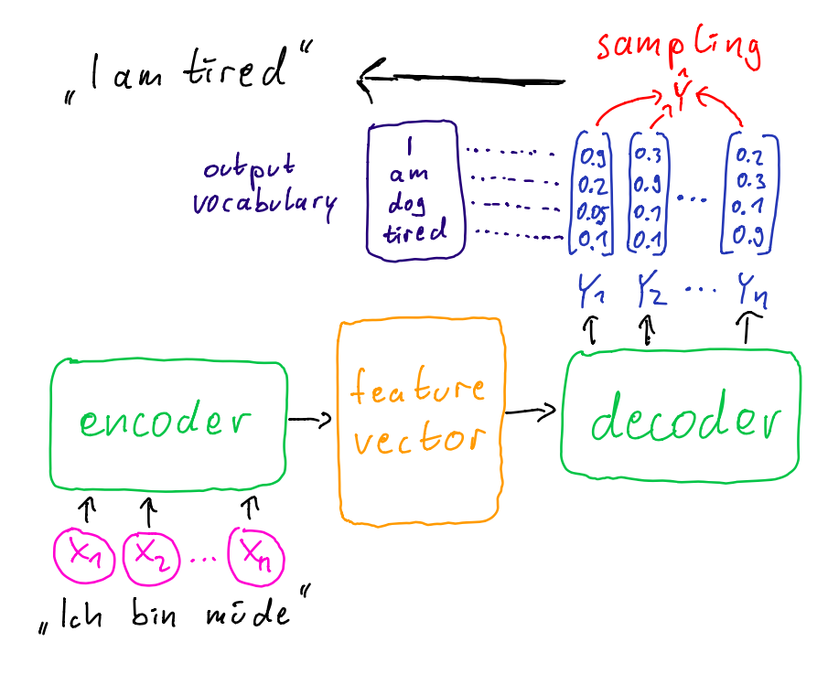

**I strongly recommend reading the [html version](https://wuxmax.github.io/rl4nmt-review/blogpost.html) for viewing pleasures!**

# Reinforcement Learning for Neural Machine Translation
A blog-post by Max Reinhard, 16th June 2020. Based on @wu-etal-2018-study

## TL;DR

In the 2018 paper at hand Wu et al. evaluate how Reinforcement Learning (RL) methods can be leveraged to improve the performance of Neural Machine Translation (NMT). They examine the contribution of different strategies in RL training (and their combinations) to achieve higher BLEU scores based on a (then) state-of-the-art NMT model. By also leveraging large-scale monolingual data they manage to beat a proclaimed state-of-the-art.

## Introduction
First I will give a brief explanation about what NMT is and what is up with the field's standard evaluation metric BLEU. Then I will explained how the NMT problem is transferred to the world of RL. Following that I present you the different RL training strategies that have been investigated in this paper and try to make sense of them. A short walk-through of the experimental setup and sequence of experiments comes next while also displaying the observed results. Lastly I will tell you my opinion about the paper and what I think are open questions and therefore interesting future research directions. But before all of that I want to give a little bit of context of who the authors are.

### About the authors
The paper lists five authors which were (or still are) situated at *Microsoft Research Asia* and the *School of Data and Computer Science at Sun Yat-sen University* in China. Looking at their publication record it seems as some of them have been in active in NLP research for some time, but most activity stems from the last two years. The research of all of them has been focused on NMT since 2018 and part of the authors also have collaborated on other publications in that field.

### What is NMT?
The term "Neural Machine Translation" ist used to describe the field of applying (deep) neural models for the task of translating a sequence of words from one natural language to another. There are other paradigms in machine translation like "Statistical Machine Translation" or rule-based approaches, which have been used in the past. In 2013 and 2014 the first papers were published presenting neural models which performed well for translation task. Then two years later it became of practical and public use as large tech companies started deploying neural models for their translation services.[^1][^2]

  
*Figure taken from: [The Encoder-Decoder Framework and Its Applications
](https://link.springer.com/chapter/10.1007/978-3-030-31756-0_5)*  

NMT models generally follow a sequence-2-sequence approach that is realised by encoder-decoder networks. So the input is a sequence of words which is encoded into a vector by the encoder. This vector is then passed as input to the decoder which predicts a sequence of output words which is the proposed translation of the input.

Typically the neural models that are used are RNNs with some form of attention mechanism. The best result - as with most NLP tasks today - are now achieved by leveraging transformer models.[^3] Just recently the new GPT-3 model was used to achieve substantial improvements of the state-of-the art in a few-shot setting for English-French translation.[^4] 

Independently of the specific architecture these NMT models are typically trained with Maximum-Likelihood-Estimation (MLE) resulting in the following loss function: 

$L_{MLE} = \sum_{i=1}^N\log{p}_\theta(y^i\vert x^i)= \sum_{i=1}^N\sum_{t=1}^m\log{p}_\theta(y^i_t\vert y^i_1,...,y^i_{t-1},x^i)$  

Here $\{x^i,y^i\}_{i=1}^N$ is the set of training examples, which consist of sentence pairs in two languages (parallel data). Thereby the model parameters $\theta$ are optimized to raise the probability, that the sentence $y^i$ is generated as output when given the sentence $x^i$ as input.

The important point to note here that this is a token-level objective: "At each decoding step t of model training, the probability of generating a token $y_t$ is maximized conditioned on $x$ and $y_{<t} = (y1, ..., yt−1)$." @wu-etal-2018-study. 

So to sum it up: This is classical supervised learning with parallel data.

### Evaluation metric: The big (bad) BLEU
Although it has been subject to a wide array of criticism[^5][^6], the BLEU metric is the standard evaluation metric for machine translation since it was introduced in 2002.  
Johann described how BLEU works in detail in his blog-post about sentence generation[^7], so I will just explain it briefly: The idea is to compare a candidate sentence to one or more reference sentences and score the candidate by counting how many n-grams of different lengths are shared with the reference(s).  
There are other metrics like ROUGE or METEOR which try to mitigate some of the problems of BLEU but I wont dive deeper into that. For today it is important to keep in that there are problems with BLEU.

Besides the mentioned criticism, using BLEU as an evaluation metric for NMT systems entails another problem: The "loss-evaluation mismatch".
While a token-level objective is used during MLE training, the evaluation takes place on a sequence-level (i.e. sentence-level). This results in an inconsistency between training objective and evaluation metric and addressing this issue is the motivation for applying RL to NMT in the paper at hand.

  
*I did not make this but I had to put it here.   
[Taken from somewhere in the interwebs.](https://www.pinclipart.com/pindetail/JxxhTT_rl-in-nmt-clipart/)*

## RL comes into play
This work is not the first one applying RL to NMT but according to the authors "effectively applying RL to real-world NMT systems has not been fulfilled by previous works." To fill that gap, they pursued three major aspects:

1) Applying RL to state-of-the-art NMT models (which at this point in time meant NMT models based on the early Transformer models)
2) Investigating how to mitigate the "limitations" of RL learning by using the right "tricks" in the context of NMT
3) Using additional monolingual data for RL in NMT (which has been shown to be successful with MLE training)

I will talk about the first two aspects in more detail but before that I am going to explain how to make a RL problem out of your translation problem - in a few easy steps.

### How do RL and NMT fit together?
Transferring NMT into the RL world: The NMT model becomes the *agent* while and the *enviroment* at each decoding step is comprised on the previously decoded words $y_{<t}$ and the vector generated by the encoder component. A *reward* is given in form of the BLEU score by comparing the generated sentence with its respective ground truth. In this setting the parameters $\theta$ of the NMT model define the agent's _policy_ which is now subject to optimization. The resulting loss function looks like this:

$L_{RL} = \sum_{i=1}^N \sum_{y\in Y}p(\hat{y}\vert x^i)R(\hat{y},y^i)$

Here $\hat{y}$ is the generated sentence and $Y$ is the space of all possible translation sentences (every combination of words in the vocabulary of the language to translate to).  $R(\hat{y},y^i)$ is the reward as described above. Because of the sheer size of $Y$ it is impossible to exactly maximize $L_{RL}$ and therefore it is approximated by $\hat{L}_{RL}$. This approximation can be done in various ways, but in this paper they once again use the famous and well established REINFORCE algorithm.

  

(In my point of view, when incorporating the vector produced by the encoder into the environment one should limit the parameter optimization to the encoder component because the idea is for the agent to learn to take actions which are suited for the environment. If you use the reward feedback to optimize the encoder parameters, you are also learning to generate better environments, but maybe that's okay...)

### Limitations of RL
So… we just use the BLEU score as the reward and voilà we bridged the gap between training objective and evaluation score. Well unfortunately it's not that easy in practice.

The authors talk about "a few widely acknowledged limitations" (citing @DBLP:journals/corr/abs-1709-06560) of RL methods that one has to face when designing a RL system and mention two specifically:

- High variance of gradient estimation (citing @10.5555/2074022.2074088, I am not sure about referring to a nearly 20 year old publication for current challenges)
- Objective instability  (citing @DBLP:journals/corr/MnihKSGAWR13, this is the famous Atari paper)

Sadly this it is not described and explained in much detail by the authors and the cited work did not gave me clear answer either, but that is what I understood:
The high variance in gradient estimation - especially in respect to the vanilla REINFORCE algorithm - mainly comes from relying on single samples to estimate the expectation. I am going to talk about what sampling means in the context NMT in a bit.
Different techniques have been applied to remedy that drawback of REINFORCE. In this paper the authors do not make use of other algorithms which already incorporate certain improvements, but instead systematically examine different strategies for RL and their combinations in respect to REINFORCE.

## Strategies for RL: Wanna see a cool trick?
There some challenges when designing a RL system and there are some tricks or strategies to deal with them. Here is with what the authors experimented:

### Reward computation
**Sampling $\hat{y}$**  
Earlier I talked about that the decoder part of the NMT model produces a sequence of words which is the translation generated by the model. But this is missing a last step. The model actually outputs a probability distribution over its vocabulary in every decoding step and not directly a word (or token). For MLE training this is irrelevant because we are looking at the probability to generate the reference sentence and do not have to compare it to an actual generated sentence. For RL training this is different because we need an actual sentence to evaluate to compare it to the reference and measure the BLEU.

  

I do not know what current approaches to sampling in NMT are independently of RL training, but beam search seems very popular and quite effective [@freitag-al-onaizan-2017-beam]. For the computation of BLEU rewards there are two established strategies:

- Beam search
- Multinomial sampling

The authors argue that these two strategies reflect the "exploration-exploitation dilemma". With beam search being the one to better exploit the output of the NMT model, while multinomial sampling is said to explore more diverse candidates. I wont go into more detail about how these techniques work.

**Reward shaping**  
Inherently the reward defined through the BLEU score is terminal, i.e. it is only given at the end of each sentence. But to arrive at the end of a sentence the agent may have taken tens of actions as sentences can become quite long. How does the agent know at each step which word to choose if it only gets its cookie (or its… uh… its root canal treatment in the case of negative rewards) at the end? 

This problem of delayed rewards is addressed by reward shaping.[^8] The idea here is to generate an intermediate reward at each step by awarding an appropriate share of the terminal reward. So by giving the agent little pieces of the cookie it gets hints of how good the previous action was. The question remains how to pick the right size of cookie crumble. 

For this work the authors use a form of reward shaping, which had been used for sequence prediction by @DBLP:journals/corr/BahdanauBXGLPCB16. Here the intermediate reward at step $t$ is defined as $r_t(\hat{y}_t,y) = R(\hat{y}_{1...t},y^i) - R(\hat{y}_{1...t-1},y^i)$, where $R(\hat{y}_{1...t},y^i)$ is the BLEU score of the first $t$ generated words. So the intermediate reward is the gain in BLEU score achieved by adding that word. Makes sense to me.  
In their training they then used the cumulative immediate rewards to update the policy at each step, but I am gonna leave it at this now in regards to reward shaping.

**Baseline reward**  
This idea is directly related to reducing the variance of the gradient estimation. To reduce this variance a baseline reward is subtracted from the previously described reward. That can be the shaped reward or the terminal reward. Imagine getting on average about a cookie for everything you do. Then the interesting part is whether you sometimes only get half a cookie or maybe even two on special occasions. An action is thereby encouraged when it is rewarded higher than the baseline and discouraged when it is rewarded lower. Talking math that means:

$R' = R - R_{baseline}$ , where $R$ is either the shaped or terminal reward.  
So $R' > 0$ for $R > R_{baseline}$ and $R' < 0$ for $R < R_{baseline}$.

Well… how do we get that baseline reward? We somehow have to estimate an suitable average of the reward that is to be expected. They used a two-layer perceptron regressor with Relu activation units to estimate the baseline reward function. By pre-training the baseline function for 20k steps/mini-batches they gave it a head start and then jointly trained the NMT model (with RL) and the baseline function. Yeah… ok we somehow have to compute that baseline reward.

**Sum it up!**  
We have seen three different decisions that can be made in respect to reward design when using RL for NMT training. Obviously there is more, but that is what the authors are looking at:

- Sampling: beam search or multinomial
- Reward shaping: yes or no
- Baseline reward: yes or no

So that's it with the rewards for now and we are going to have a look at another strategy for using RL with NMT.

### Combining objectives
Remember the training objectives $L_{MLE}$ and $\hat{L}_{RL}$ from earlier? The next cool trick is to to combine these objectives somehow to stabilize the objective (which was the other claimed limitation of RL, in case you forgot).  
This can be done either sequentially or simultaneously. The sequential approach can be realized e.g. by first training the model in classical supervised fashion and then fine-tune it with reinforcement learning or by alternating the objective per training batch. Simultaneously incorporating the two objectives can be done by simple linear interpolation [@kreutzer:rlnmt:18]. And this is exactly what has been done in this paper:

$L_{combined} = \alpha * L_{MLE} + (1 - \alpha) * \hat{L}_{RL}$

The question open to investigation now is how to choose that alpha for best results.

### Monolingual data
The last strategy for improving the translation quality of NMT models is the use of monolingual date (i.e. not parallel data). This actually has nothing to do with RL in particular, but since it never had been done in combination with RL training, the authors decided that it is worth a shot. So how is monolingual data thought to yield improvement for the translation task?  

First of all, let us quickly define two terms: target-side monolingual data means data in the language to which translate to and source-side monolingual data means data in the language from which to translate. Ok. 

@sennrich2015improving report substantial improvements with the use of target-side monolingual data and argue that it "plays an important role in boosting fluency". And that makes sense to me as the model is able to learn more about the statistical properties of the target language, essentially building a better language model. The key novelty in the work of @sennrich2015improving is that they did not train a separate language model but incorporated the monolingual data into the NMT model training itself.

So again the question is: How do we do that? Actually we make parallel data out of our monolingual data. Luckily we have a NMT model which can translate sentences…  
For target-side monolingual data the authors follow the approach of @sennrich2015improving by training a reverse NMT model with parallel data and than back-translate the monolingual data to get the respective source-side sentence. And for source-side monolingual data it is even simpler: They just predict a pseudo-reference by doing a forward pass with the NMT model and use beam search to sample from the models output (note the use of beam search here and not multinomial sampling).

For me that seemed kind of fishy to train the model with data that was more or less generated by itself, but it seems to be an established method. I think it is important to note that the goal here is not primarily to improve the matching between the two languages but to improve the modeling of the languages itself.

## Experiments and Results: Showing us what they got
A fairly systematic empirical study of applying these different strategies has been conducted in this work. If you would actually try to evaluate every combination of the design decisions mentioned above, the number of experiments to run would explode. Take alone the three decisions in reward computation (2^3), then assume 5 different values for alpha (2^3 * 5) and maybe with source-side monolingual data, with target-side monolingual data and with both (2^3 * 5 * 3). There you go: Have fun with running and evaluating 120 different experiments. And that's only one evaluation task. So one has to be clever about this. The authors came up with the following:

### General setting
**The tasks**  
For evaluation three different standard translations tasks were used, that are provided by the "Conference of Machine Translation" (WMT):

- WMT14 English-German (En-De, one of the very popular ones it seems when you look at all the publications using it)
- WMT17 English-Chinese (En-Zh)
- WMT17 Chinese-English (Zh-En)

The last two tasks unsurprisingly use the same dataset and the Chinese background of the authors might explain their particular interest in using it.

Only the RL training strategies have been evaluated on all three tasks, while all the experiments in regard to leveraging monolingual data have only been evaluated on the last one. Therefore I will examine the dataset for the last (two) task a little bit more (but the other dataset is of similar structure).

**The data**  
It contains about 24M sentence pairs from the news domain and the _UN Parallel Corpus_. The latter is a corpus of translated sentences from publicly available United Nations documents, so I am assuming something like press-releases i.e. also news-like documents. As dev and test set there are two sets given which were created by sampling English online newspaper and professionally translating them. For the monolingual data they used the _LDC Chinese Gigaword (4th edition)_ and the _News Crawl 2016_ datasets for Chinese and English respectively which both are news corpora. After filtering this resulted in 4M Chinese and 7M English sentences. All these datasets are available on the [WMT17 website](https://www.statmt.org/wmt17/translation-task.html), albeit not necessarily under public access.

**The model**   
_TRANSFORMER FTW!!!1!11_ or more delicately put: as NMT model they adopt the famous Transformer model presented by @46201. For English-Chinese (and vice-versa) they used the *transformer_big* setting and the *transformer_base_v1* setting for English-German. Nearly the same configurations as in the original paper were used and the MLE training was also done in a pretty standard way using *Adam* as optimizer.

### Experimental sequence
***Testing different RL strategies***  
Like I said before, they different "tricks" or strategies for RL were tested on all three tasks. After running one type of experiment, the strategy which yielded the best results was then used in future experiments. In that way the amount of experimental setups remains reasonable. (Still amounting to 25 in total, because they tested a lot of different setups for using monolingual data, but more on that later.)

Each experimental setup is conducted at least 5 times and if I understood it correctly the the reported result is the averaged performance of these runs on the test set. The configurations for these evaluations on the test set for each run is the configuration which achieved the best result on the validation sets. So far so good.

First they examine which ***sampling technique*** to use and whether to use ***reward shaping*** or not:

  
*Table taken from @wu-etal-2018-study*

I think the table is pretty self-explanatory. MLE refers to the performance of the pre-trained model. The reward is either the terminal reward or the shaped reward and the sampling method is either beam search or multinomial sampling.  
The authors state their surprise about the fact that multinomial sampling performs better than beam search and conclude the importance of exploration for reward computing. Apart of that they report that using reward shaping makes "no big difference" but performs marginally better and decide to use multinomial sampling and reward shaping in the following experiments.

Second they examine whether to incorporate a ***baseline reward*** into the reward computation or not:

  
*Table taken from @wu-etal-2018-study*

Again I think the table explains itself. Here they observe that subtracting a baseline reward does not improve the results, which contradicts future results by @ranzato2015sequence. Therefore they decide to not incorporate the baseline reward by taking the "economic perspective". (read: it's just not worth it)

Lastly for this chapter, they examine different weights for the linear ***combination of the training objectives***:

  
*Figure taken from @wu-etal-2018-study*

Pretty straight forward again. The best results for all tasks were achieved with $\alpha = 0.3$ and therefore the authors conclude that the combination of the two objectives indeed helps stabilizing the training. Alpha is set accordingly in the following experiments.

**Sum it up!**  
Looking at the findings we got so far this can be condensed to:

- Sampling: multinomial
- Reward shaping: don't care (yes )
- Baseline reward: don't care (no)
- Linear objective combining: $\alpha = 0.3$ 

**Using monolingual data**  
As I mentioned before a great number of different experimental setups regarding the training with monolingual data are conducted in this work. They try a lot of possible combinations of training method (MLE or RL) and usage of monolingual data (source-side, traget side and both). Although this evaluation makes up a whole page of the paper I don't find it to be of that great importance for this review as training with monolingual data is not inherently related to reinforcement learning. And in the end they achieved the best results by using all of the data for both objectives…  

I will just show you the last result table where they also compared different versions of their model with existing work:

  
*Table taken from @wu-etal-2018-study*

The score of $25.04$ observed for *Transformer + RL* is the score that you can see in the bar chart above for the respective task (Zh-En, right bar) with $\alpha = 0.3$. When there is no *+ RL* at the end that means that only MLE training was used in this case. 

**It comes to an end.**  
The evaluation is concluded by stating that "the results clearly show that after combing both source-side and target-side monolingual data with RL training, we obtain the state-of-the-art BLEU score $26.73$, even surpassing the best ensemble model in WMT17 Zh-En translation challenge".

In total the findings amounts to the following: Multinomial sampling is better than beam search, reward shaping and reward baselines do not make much of a difference and a linear combination of MLE and RL objective is effective for a suitable weighting parameter choice. And monolingual data is best leveraged by using source-side and target-side data for MLE and RL training. (read: give me all the data every time please).

## So what?
### My opinion
 At first I was very exited about this paper because NMT is such a relevant taks in NLP, probably the one which as the most direct application in day-to-day use for most people. And seeing how RL can be applied to something you would not immediately think of is always nice. Unfortunately I am not very convinced that it makes very much sense to do so in the way presented in the paper at hand, but let me name a few positive aspects first:
 
 - The empirical study is very well structured and gives a nice impression on how one can combine and examine different techniques and strategies that have been proposed in previous work.
 - All of the code and configurations that were used for the experiments are [publicly available on GitHub](https://github.com/apeterswu/RL4NMT) so it should be relatively easy to comprehend and reproduce them.
 - I did not know about the presented strategies for RL training so learning about them and how they were applied in the NMT setting was very interesting.

Now for the not so nice parts:

- There was no real assessment of the scope of the validity of the presented findings. I can not really judge if the findings hold outside of this specific task with these specific preconditions (e.g. base model and previously made strategy decisions). But at least for using baseline rewards there is contradicting highly cited work[^9] @ranzato2015sequence
- I did not like that a major part of the paper was about how to use monolingual data for training the model, because that has been done before and has nothing to do with RL in particular. Although admittedly this is the first work to combine it with RL.
- Improvements of the result were always reported by additional RL training on top of MLE training. I am bit suspicious here because that means that the model was trained even more on the same data. As all of the data is from the news domain, that could mean that the model was fitted even more to that domain and therefore performing better in the evaluation task but not in a real-world scenario.
- The reason to use RL for NMT in the first place was to bridge the loss-evaluation mismatch by defining a training objective that is directly related to the BLEU score. But considering the mentioned critic of BLEU it is questionable to me whether that goal is really so meaningful.

And another note, which is not really substantial criticism but kind of funny:  
In the final sentence of the evaluation the authors state that they "obtain the state-of-the-art BLEU score $26.73$, even surpassing the best ensemble model in WMT17 Zh-En translation challenge". While this is true regarding to the challenge which took place in 2017, it was not state-of-the-art at the time this paper was submitted to arXiv. A few month earlier another paper was submitted, which reported higher scores than in the paper at hand ( $27.38$ for single-model and $28.46$ as ensebmle), see @DBLP:journals/corr/abs-1803-05567. Normally I would not be that picky, but [Lijun Wu](https://scholar.google.com/citations?user=RD5kSG0AAAAJ&hl=en) (the primary author of this paper) is also listed as co-author of the other paper, so he should have known about that ;)

### Ideas for future research
The ideas I have for future research will be reflected in the discussion topics so I am phrasing them as questions here directly:
 
 - How can RL be applied to NMT without using supervised (parallel) data to simulate the rewards? What other rewards could be used? (e.g. using real feedback by humans)
 - Do you know other "tricks" for RL training that could be useful in the context of NMT? Or maybe even other RL methods than REINFORCE? (e.g. Actor-Critic)
 - What could be different ways to address the loss-evaluation mismatch? And is there a different application for RL in NMT?

If you made it this far I would like to let you know that there is another blog-post dissecting the use of RL in NMT with reference to the paper I reviewed here. Only the other one is written by someone how is probably getting a six-figure salary as research scientist at *Google Translate* and not six credit point as master student at *University of Potsdam* (no offense :P). Unsurprisingly this is also reflected in the depth of the analysis at some points, so go check [it](https://www.cl.uni-heidelberg.de/statnlpgroup/blog/rl4nmt/#nmt-as-an-rl-problem) [@kreutzer:rlnmt:18] out if you still have not heard enough!

## References
- [http://nlpprogress.com/english/machine_translation.html](http://nlpprogress.com/english/machine_translation.html)
- [https://medium.com/syncedreview/history-and-frontier-of-the-neural-machine-translation-dc981d25422d](https://medium.com/syncedreview/history-and-frontier-of-the-neural-machine-translation-dc981d25422d)

***

[^1]: [https://www.blog.google/products/translate/found-translation-more-accurate-fluent-sentences-google-translate/](https://www.blog.google/products/translate/found-translation-more-accurate-fluent-sentences-google-translate/)
[^2]: [https://www.microsoft.com/en-us/translator/blog/2016/11/15/microsoft-translator-launching-neural-network-based-translations-for-all-its-speech-languages/](https://www.microsoft.com/en-us/translator/blog/2016/11/15/microsoft-translator-launching-neural-network-based-translations-for-all-its-speech-languages/)
[^3]: [https://paperswithcode.com/sota/machine-translation-on-wmt2014-english-german](https://paperswithcode.com/sota/machine-translation-on-wmt2014-english-german)
[^4]: [https://paperswithcode.com/sota/unsupervised-machine-translation-on-wmt2014-1](https://paperswithcode.com/sota/unsupervised-machine-translation-on-wmt2014-1)
[^5]: [Why do we still use 18-year old BLEU?](https://ehudreiter.com/2020/03/02/why-use-18-year-old-bleu/)
[^6]: [Evaluating Text Output in NLP: BLEU at your own risk](https://towardsdatascience.com/evaluating-text-output-in-nlp-bleu-at-your-own-risk-e8609665a213)
[^7]: [More flexible sentence generation](https://moodle2.uni-potsdam.de/pluginfile.php/1362629/mod_resource/content/2/johann_seltmann.pdf)
[^8]: Click [here](https://www.youtube.com/watch?v=xManAGjbx2k) to see a video which explains the idea of reward shaping with dolphins jumping through burning hoops.
[^9]: [The authors Google Scholar page](https://scholar.google.com/citations?user=NbXF7T8AAAAJ&hl=en) lists 741 citations
